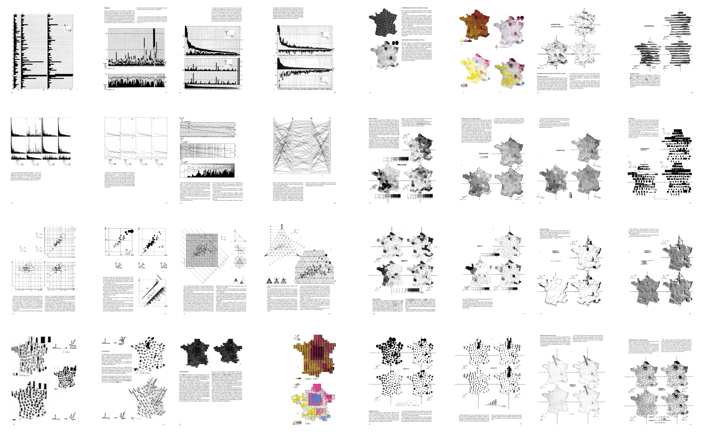
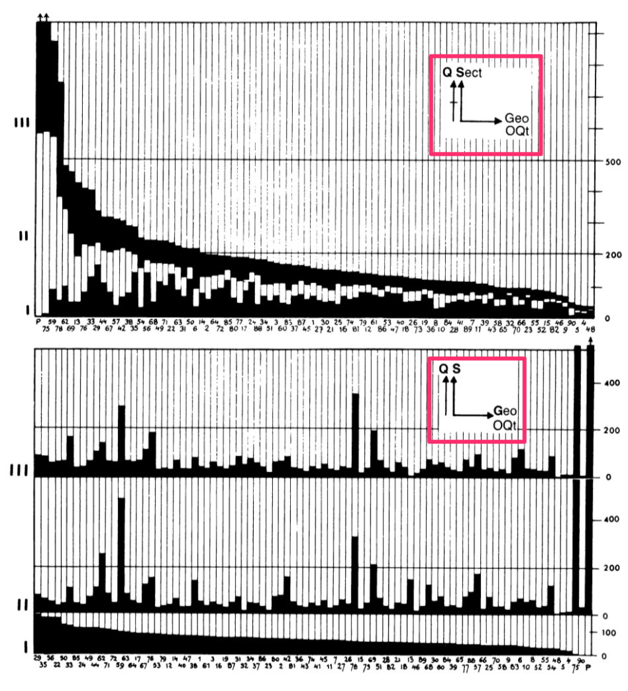
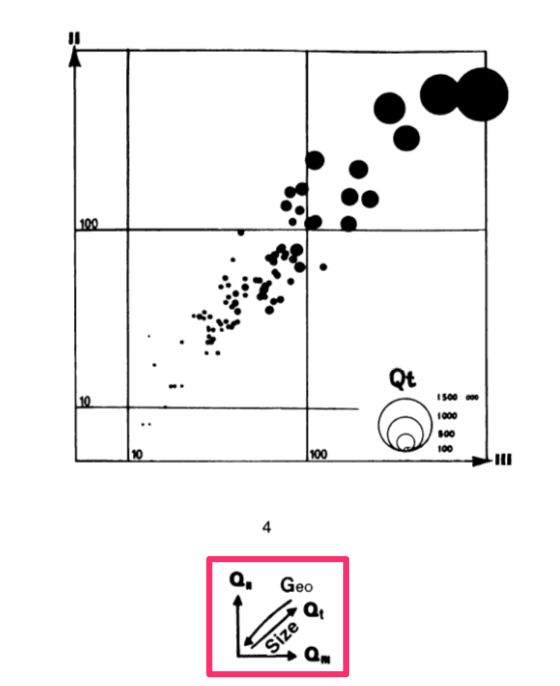
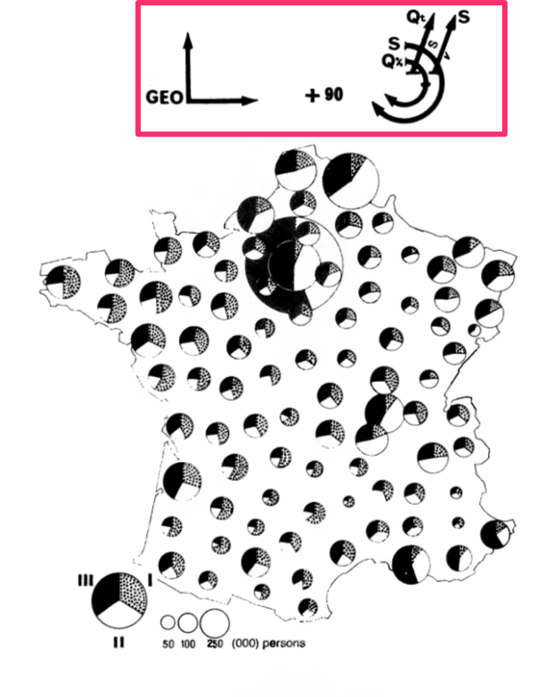

---
jupyter:
  jupytext:
    formats: md,ipynb
    text_representation:
      extension: .md
      format_name: markdown
      format_version: '1.2'
      jupytext_version: 1.4.2
  kernelspec:
    display_name: Python 3
    language: python
    name: python3
---

# Remaking Figures from *Semiology of Graphics*
by [Nicolas Kruchten](https://nicolas.kruchten.com/)

One of my favourite books about data visualization is [*Semiology of Graphics: Diagrams, Networks, Maps* by Jacques Bertin](https://books.google.ca/books/about/Semiology_of_Graphics.html?id=X5caQwAACAAJ&source=kp_book_description&redir_esc=y), from 1967. It's a dense, 450-page tome which is now considered a classic in the development of the field. Michael Friendly, in his [Brief History of Data Visualization](http://datavis.ca/papers/hbook.pdf), identifies it as one of three key factors in the late-20th century renaissance in data visualization (following a golden age in the 19th century and a dark age in the early 20th). One of my favourite parts of the book is a 40-page section called "The Graphic Problem", which enumerates by example 100 different visualizations of the same compact dataset, to outline what we would now call the design space of visualizations, and to forcefully make the point that the choice of which visualization to use for a given dataset is far from obvious. The dataset, which is printed in a small table at the beginning of the section, is quite simple on its face: the number of people working in agriculture, industry and services for each of 90 administrative divisions in France in 1954 (there are four other, derived columns: the sum of the first three, and each of the first three divided by the sum). 

I don't think I can reasonably reproduce the entire section at high resolution here, but I'm including an overview of 32 of those pages, which should give a sense of the breadth of visual forms covered. There are bar charts (faceted, stacked, reordered, variable-width), scatterplots and scatterplot matrices, a parallel-coordinates plot, some ternary plots, and that's before we even get to maps. There are cartograms and dot maps and choropleths and maps with pies and bars on them, and some stippled and striped maps that I don't believe have distinct names, as I've only ever seen them in this book!



The dataset is quite similar to one I spent a lot of time exploring through visualizations: the vote split between the top 3 candidates in a local Montreal mayoral election, which I visualized as a [dot map](http://nicolas.kruchten.com/content/2013/12/dot-map-of-2013-montreal-election-results/), [ternary charts](http://nicolas.kruchten.com/content/2014/01/mtlelection-ternary/), [mosaic charts](http://nicolas.kruchten.com/content/2014/01/mtlelection-early_voting/), [choropleth maps](http://nicolas.kruchten.com/content/2014/01/mtlelection-zoomable-map/) and [pies-on-maps](http://nicolas.kruchten.com/content/2015/08/election-pies/). When I read this book I was pleased to see every idea I'd had was represented and I was fascinated to see so many new ones, and I've been wanting to remake these graphics with modern tools ever since. I recently read the excellent new book [*Visualizing With Text* by Richard Brath](https://books.google.ca/books/about/Visualizing_with_Text.html?id=dAoHEAAAQBAJ&source=kp_book_description&redir_esc=y), which includes a number of text-based remakes of these same figures, which motivated me to actually carry out this project. I'm pleased that the visualization library I've been working on for the past couple of years, [Plotly Express](https://plotly.express), is now mature enough to let me do a decent job at many of these graphics with just a few lines of code.


## An Intellectual Ancestor

Before getting into the remakes, I want to talk about one neat little feature of this book. Each of these graphics is accompanied by a little glyph, like the one highlighted below, which the book explains how to interpret or generate. 

<br />
<table><tr>
    <td></td>
    <td></td>
    <td></td>
</tr></table>
<br />

Each glyph is basically a very compact graphical specification/explanation of the chart, a kind of meta-legend. The L-shaped portion indicates which data variables are mapped to the X and Y axes (sometimes indicating order with an O character, as in the first figure on the left, ordered by Qt for total quantity), and any additional vertical or horizontal lines outside of that indicates faceting/stacking (lines without a crossbar, as in the lower half of the first image) or cumulative stacking variables (lines with a little crossbar, as in the upper half). Diagonal lines indicate data variables that are embedded into (Geo in the second impage) or mapped to variables that "jump out" of the page, like color, size, value etc (the diagonal line appears to be missing in the top figure of the first image, and Qt is mapped to size in the second image). There are similar little glyphs for pie charts, maps, ternary charts etc. The third image shows the complex glyph for 90 scaled pie charts overlaid on a map: the X/Y dimensions are geography, and the pie charts are stacked by S for sector, cumulatively scaled by Q for quantity, and then sized by Qt for total quantity, and shaded by S for sector.

What I find fascinating about these little glyphs is that they are in a way the intellectual ancestors of the code blocks you'll find below, which are used to generate the interactive figures. I don't know if Bertin would sketch these glyphs first, then make the charts, or if he drew them on afterwards, but with modern tools like Plotly Express, we can write just a few lines of code which express the same ideas as these glyphs (in rather less ambiguous form) and the figures just appear! For those who know how to read the code, it also provides a clear specification of the figure. This is possible because the design of these libraries was informed by a line of thinking which originated from this book, i.e. the formalized semiological notion idea that visualization involves a sign-system wherein visual variables (signifiers) are mapped onto data variables (signifieds). The little glyphs I mentioned above were part of the explanation of this mapping. This line of thinking and its relationship to visualization software was further elaborated in a book called [*The Grammar of Graphics* by Leland Wilkinson](https://books.google.ca/books/about/The_Grammar_of_Graphics.html?id=ZiwLCAAAQBAJ&source=kp_book_description&redir_esc=y) in the 90s, and then embedded into multiple subsequent generations of visualization software since, including Plotly Express.


## Data & Prep

The first step to remaking these figures with Plotly Express was to get the data into a Python-friendly format. The dataset nominally contains only a few columns of numbers, but in order to make maps we actually need some geographic data as well! This is sort of implicit in the book, but when working with code, everything must be made explicit. This was a little bit of a challenge since french administrative divisions have evolved a little bit since 1967, when the book was published, and the data was from 1954. I found [a set of polygons for the boundern boundaries of french departments](https://github.com/gregoiredavid/france-geojson) and modified them as follows, to match the data in the book:

1. I undid [the 1964 reorganization](https://fr.wikipedia.org/wiki/R%C3%A9organisation_de_la_r%C3%A9gion_parisienne_en_1964#/media/Fichier:Ile_de_France_departments_1968_evolution_map-fr.svg) of the Paris-region departments by merging departments 91 and 95 into department 78, and merging 92, 93 and 94 into 75. 
2. I then subtracted the present-day department 75 (the city of Paris) from the resulting department 75 and labelled it "P", as in the dataset in the book. I believe that Paris was carved out from its surrounding department to avoid department 75 from totally dominating all figures population-wise, although this is not called out in the book specifically.
3. I dropped Corsica (20) as no data was provided for this island department.
4. I simplified the geometry of the polygons to reduce the file size and even out some of the inaccuracies I introduced when I merged the Paris-region departments. The simplified polygons have approximately the same level of detail as the maps in the book, which are only rendered a few inches across anyway.
5. I added two new columns which I explain in the text below: `region`, which is the modern-day administrative division that regroups multiple departments, and `type`, which indicates the relative rank of the three economic sectors in a given department: type `A>S>I` means there are more people working in agriculture than in services, and more in services than industry, etc.

Here is what the resulting dataset looks like, when loaded from a 55kb GeoJSON file (available here) using `geopandas`. (Note: for anyone wanting to play with this data, there's also a CSV that doesn't include the polygons.)

This dataset is in "wide form" i.e. one row per department with multiple data colums, so I've loaded it as `wide_df`.

```python
import geopandas as gpd
wide_df = gpd.read_file("semiology_of_graphics.geojson").set_index("code")
display(wide_df.head(5))
```

It's actually more convenient to make certain kinds of figures, especially faceted ones, if the data is in "long form" i.e. one row per department per sector, so we'll also un-pivot, or `melt()` the wide form dataset and store the result in `long_form` for use below.

```python
long_df = wide_df.reset_index().melt(
    id_vars=["code", "department", "total", "region", "type", "geometry"],
    value_vars=["agriculture", "industry", "services"],
    var_name="sector", value_name="quantity"
).set_index("code")
long_df["percentage"] = 100* long_df.quantity / long_df.total
display(long_df.head(5))
```

Finally, we'll load Plotly Express and preconfigure some default values which we'll reuse throughout the various figures. Notably, we'll set some default colors and rendering orders for the `sector` and `type` variables.

```python
import plotly.express as px
px.defaults.height=500
px.defaults.color_discrete_map = {
    'agriculture': px.colors.sequential.Greens[5], 
    'industry': px.colors.sequential.Reds[5], 
    'services': px.colors.sequential.Blues[5],
    'S>A>I': '#5588BB','S>I>A': '#8855BB','I>S>A': '#BB5588',
    'I>A>S': '#BB8855','A>I>S': '#88BB55','A>S>I': '#55BB88'
}
px.defaults.category_orders = dict(
    sector=["agriculture", "industry", "services"],
    type=['S>A>I','S>I>A','I>S>A','I>A>S','A>I>S','A>S>I']
)
```

## The Remakes

The first figure we'll make is a simple faceted bar chart of the raw counts. This figure is interactive in that you can hover over any bar to see the details of the data it encodes, which goes some way towards mitigating the legibility issues of the tiny font used in the labels (a problem in the book also!). In the book all the bars were black, but here I've colored them using the convention I'll use throughout: green for agriculture, red for industry and blue for services.

```python
fig = px.bar(long_df, x="quantity", y="department", color="sector", facet_col="sector", height=600)
fig.update_layout(bargap=0, showlegend=False)
fig.update_yaxes(tickfont_size=4, autorange="reversed")
fig.show()
```

Here's the same data in a stacked bar chart, which lets us more easily see the total population of each department by looking at the heights of the bar stacks:

```python
fig = px.bar(long_df, x=long_df.index, y="quantity", color="sector", hover_name="department")
fig.update_layout(bargap=0, legend_xanchor="right", legend_x=0.99, legend_y=0.99)
fig.update_xaxes(type="category", tickfont_size=5, tickangle=-90)
fig.show()
```

Here's the same data except each stack has been merged together into a single bar, now colored by the `type` column. Stacks with more blue than red and more red than green are now a blueish purple, for example.

```python
fig = px.bar(wide_df, x=wide_df.index, y="total", color="type", hover_name="department", 
             hover_data=["agriculture_pct", "industry_pct", "services_pct"], )
fig.update_layout(bargap=0, legend_xanchor="right", legend_x=0.99, legend_y=0.99)
fig.update_xaxes(type="category", tickfont_size=5, tickangle=-90, categoryorder="total descending")
fig.show()
```

Going back to stacked bars, we can map the population of the department to the width of the stack instead of its height, so that each bar extends to 100%, allowing us to more directly compare percentages between stacks, while preserving a visual sense of how many people each stack represents:

```python
fig = px.bar(long_df, x=long_df.index, y="percentage", hover_name="department", color="sector",
             hover_data=dict(code=long_df.index, total=True), range_y=[0,100])

fig.update_traces(x=wide_df["total"].cumsum()-wide_df["total"], width=wide_df["total"], offset=0)
fig.update_xaxes(type="linear", tickangle=0, tickfont_size=6,
                 tickvals=wide_df["total"].cumsum()-wide_df["total"]/2, 
                 ticktext= ["%s" % l for l in wide_df.index])
fig.update_layout(bargap=0, barnorm="percent", legend_orientation="h", legend_y=1.1)
fig.show()
```

Moving from bars to lines as a visual representation, here is a parallel coordinates chart where each department is one line that zigzags through its corresponding data points in 4 dimensions: the percentage of workers in each sector and the total population of the department. Lines are colored by the percentage of workers in industry in varying intensities of red, naturally. Try drag-selecting the dimensions to select/deselect lines!

```python
fig = px.parallel_coordinates(wide_df, dimensions=["agriculture_pct", "industry_pct", "services_pct", "total"],
                              color="industry_pct", color_continuous_scale="reds", range_color=[0,65])
fig.update_traces(dimensions=[dict(range=[0,75]),dict(range=[0,75]),dict(range=[0,75]), dict(range=[0,1700000])])
fig.show()
```
```python
fig = px.scatter(long_df, x="total", y="percentage", color="sector", facet_col="sector",
                 hover_name="department", log_x=True)
fig.update_layout(showlegend=False)
fig.show()
```

```python
fig = px.scatter_matrix(wide_df, dimensions=["industry", "services", "agriculture"], size="total",
                        color="type", opacity=1, hover_name="department", height=600)
fig.update_layout(legend_xanchor="right", legend_x=0.8, legend_y=0.95)
fig.update_traces(diagonal_visible=False, showupperhalf=False)
for i in range(1,4):
    fig.layout["xaxis"+str(i)] = fig.layout["yaxis"+str(i)] = dict(type="log")
fig.show()
```

```python
fig = px.scatter_ternary(wide_df, a="agriculture", b="industry", c="services", size="total",
                         color="type", opacity=1, hover_name="department")
fig.update_layout(legend_xanchor="right", legend_x=0.99, legend_y=0.99)
fig.update_ternaries(aaxis_ticks="outside", baxis_ticks="outside", caxis_ticks="outside")
fig.show()
```

```python
fig = px.choropleth(wide_df, geojson=wide_df.geometry, locations=wide_df.index,
                    color="type", hover_name="department", 
                    hover_data=["agriculture_pct", "industry_pct", "services_pct"],
                    fitbounds="geojson", basemap_visible=False, projection="mercator")
fig.show(config=dict(scrollZoom=False))
```

```python
fig = px.choropleth(long_df, geojson=long_df.geometry, locations=long_df.index, 
                    color="percentage", facet_col="sector", hover_name="department", 
                    fitbounds="geojson", basemap_visible=False, projection="mercator",
                    height=400
                   )

for i, scale in enumerate(["greens", "reds", "blues"]):
    fig.update_traces(selector=i, coloraxis=None, zmin=0, zmax=75, colorscale=scale,
                      colorbar=dict(x=1.1-i*0.015, thickness=10, showticklabels=i==0, len=0.6))

fig.show(config=dict(scrollZoom=False))
```

```python
basepolygons = (
    px.choropleth(wide_df, geojson=wide_df.geometry, locations=wide_df.index, color_discrete_sequence=["white"])
    .update_traces(marker_line_color="lightgrey", hoverinfo="skip", hovertemplate=None, showlegend=False)
    .data[0]
)

fig = px.scatter_geo(wide_df, geojson=wide_df.geometry, locations=wide_df.index, size="total", color="type",
                     size_max=30, opacity=.8,
                     hover_name="department", hover_data=["agriculture_pct", "industry_pct", "services_pct"],
                     fitbounds="geojson", basemap_visible=False, projection="mercator")
fig.add_trace(basepolygons)
fig.show(config=dict(scrollZoom=False))
```

```python
fig = px.scatter_geo(long_df, geojson=long_df.geometry, locations=long_df.index, 
                     size="quantity", facet_col="sector", color="sector",
                     opacity=.8, hover_name="department", size_max=30, 
                     fitbounds="geojson", basemap_visible=False, projection="mercator",
                    height=400)

fig.add_trace(basepolygons, col="all", row="all")
fig.update_layout(showlegend=False)
fig.show(config=dict(scrollZoom=False))
```

```python
fig = px.treemap(wide_df, path=[px.Constant("France"), "region", "department"], values="total",
                 color="services_pct", color_continuous_scale="blues", range_color=[0,75])
fig.show()
```

```python
points_df = gpd.read_file("semiology_of_graphics_points.geojson").melt(
    id_vars=["code", "geometry", "department"], 
    value_vars=["agriculture", "industry", "services"],
    var_name="sector", value_name="quantity"
)
points_df["label"] = points_df["code"].apply(lambda d: d if d in ["P", "75"] else None)


fig = px.scatter_geo(points_df, lat=points_df.geometry.y, lon=points_df.geometry.x,
                     size="quantity", facet_col="sector", size_max=30,  opacity=.8,
                     color_discrete_sequence=["#333333"],
                     hover_name="department", text="label", hover_data=dict(label=False),
                     fitbounds="geojson", basemap_visible=False, projection="mercator")

fig.update_traces(textposition="bottom center")
fig.add_trace(basepolygons, row="all", col="all")
fig.show(config=dict(scrollZoom=False))
```

```python
fig = px.scatter_geo(points_df, lat=points_df.geometry.y, lon=points_df.geometry.x,
                     size="quantity", color="sector",
                     size_max=25, opacity=0.9,
                     hover_name="department",
                     hover_data=dict(label=False),
                     fitbounds="geojson", basemap_visible=False, projection="mercator")

fig.data = fig.data[::-1]

for i, t in enumerate(fig.data):
    t.lat = t.lat-0.11*(i-1)
    t.lon = t.lon-0.11*(i-1)

fig.add_trace(basepolygons, row="all", col="all")
fig.show(config=dict(scrollZoom=False))
```

now what?

links to plotly
links to my website
links to other related things

also requirements.txt
link to binder to run this yourself

encouragement to remake things like the cool stripey one or overlaid textures
