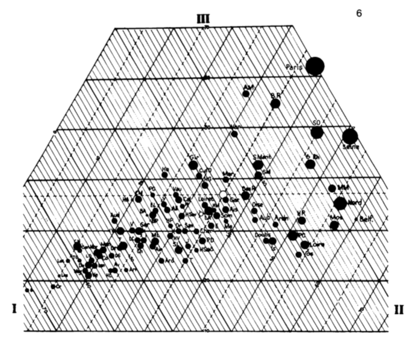
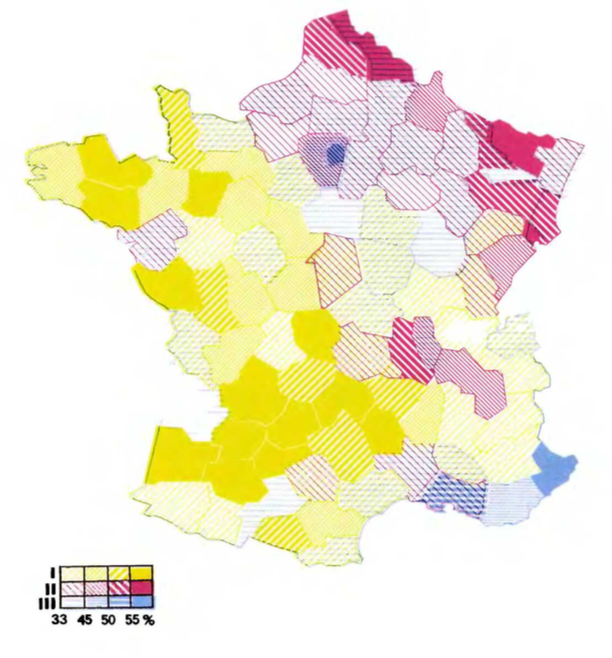
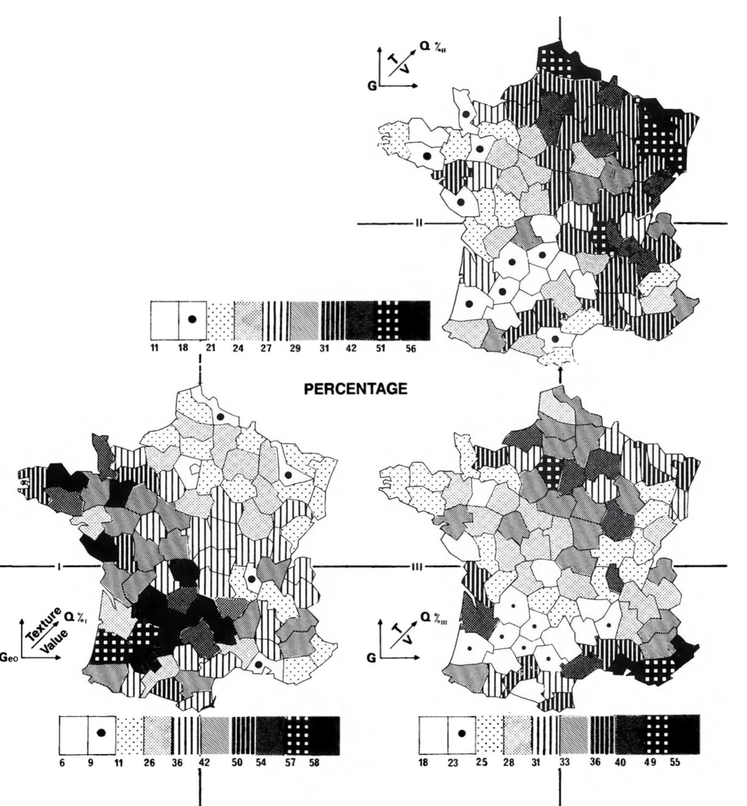

---
jupyter:
  jupytext:
    formats: md,ipynb
    text_representation:
      extension: .md
      format_name: markdown
      format_version: '1.2'
      jupytext_version: 1.4.2
  kernelspec:
    display_name: Python 3
    language: python
    name: python3
---

# Remaking Figures from <br>Bertin's *Semiology of Graphics*
<p style="text-align: center">by <a target="_blank" href="https://nicolas.kruchten.com/">Nicolas Kruchten</a></p>

One of my favourite books about data visualization is [*Semiology of Graphics: Diagrams, Networks, Maps* by Jacques Bertin](https://books.google.ca/books/about/Semiology_of_Graphics.html?id=X5caQwAACAAJ&source=kp_book_description&redir_esc=y), from 1967. It's a dense, 450-page tome which is now considered a classic in the development of the field. Michael Friendly, in his [Brief History of Data Visualization](http://datavis.ca/papers/hbook.pdf), identifies it as one of three key factors in the late-20th century renaissance in data visualization (following a golden age in the 19th century and a dark age in the early 20th). 

One of my favourite parts of the book is a 40-page section called "The Graphic Problem", which enumerates by example 100 different visualizations of the same compact dataset, to outline what we would now call the design space of visualizations, and to forcefully make the point that the choice of which visualization to use for a given dataset is far from obvious, and that the visualization used must match the questions it should be used to answer. The dataset, which is printed in a small table at the beginning of the section, is quite simple on its face: the number of people working in agriculture, industry and services for each of 90 administrative divisions in France in 1954 (there are four other, derived columns: the sum of the first three, and each of the first three divided by the sum).

I don't think I can reasonably reproduce the entire section at high resolution here, but I'm including an overview of 32 of those pages, which should give a sense of the breadth of visual forms covered. There are bar charts (faceted, stacked, reordered, variable-width), histograms, concentration curves, scatterplots and scatterplot matrices, a parallel-coordinates plot, some ternary plots, and that's before we even get to maps. There are cartograms and graduated-symbol maps and contour maps and dot maps and choropleths and maps with pies and bars on them, and some stippled and striped maps that I don't believe have common names, as I've only ever seen them in this book!

<a target="_blank" href="images/spread.png"></a>

The dataset is quite similar to one I spent a lot of time exploring through visualizations: the vote split between the top 3 candidates in a local Montreal mayoral election, which I visualized as a [dot map](http://nicolas.kruchten.com/content/2013/12/dot-map-of-2013-montreal-election-results/), [ternary charts](http://nicolas.kruchten.com/content/2014/01/mtlelection-ternary/), [mosaic charts](http://nicolas.kruchten.com/content/2014/01/mtlelection-early_voting/), [choropleth maps](http://nicolas.kruchten.com/content/2014/01/mtlelection-zoomable-map/) and [pies-on-maps](http://nicolas.kruchten.com/content/2015/08/election-pies/). When I read this book I was pleased to see every idea I'd had was represented and I was fascinated to see so many new ones, and I've been wanting to remake these graphics with modern tools ever since. I recently read the excellent new book [*Visualizing With Text* by Richard Brath](https://books.google.ca/books/about/Visualizing_with_Text.html?id=dAoHEAAAQBAJ&source=kp_book_description&redir_esc=y), which includes a number of text-based remakes of these same figures, which motivated me to actually carry out this project. I'm pleased that the visualization library I've been working on for the past couple of years, [Plotly Express](https://plotly.express), is now mature enough to let me do a decent job at many of these figures with just a few lines of code.


## An Intellectual Ancestor to Plotly Express

Before getting into the figures and code, I want to talk about one neat little feature of this book. Each of these graphics is accompanied by a little glyph, like the ones highlighted below in pink, which the book explains how to interpret or generate.

<br />
<table><tr>
    <td><a target="_blank" href="images/glyphs.png"></a></td>
    <td><a target="_blank" href="images/glyphs2.png"></a></td>
    <td><a target="_blank" href="images/glyphs3.png"></a></td>
</tr></table>
<br />

Each glyph is basically a very compact graphical specification/explanation of the chart, a kind of meta-legend. The L-shaped portion indicates which data variables are mapped to the horizontal and vertical dimensions of the surface, (sometimes indicating order with an O character, as in the first figure on the left, ordered by Qt for total quantity), and any additional vertical or horizontal lines outside of that indicates faceting/stacking (lines without a crossbar, as in the lower half of the first image) or cumulative stacking variables (lines with a little crossbar, as in the upper half). Note that the horizontal and vertical dimensions are sometimes mapped to X and Y in a 2-d cartesian plot, but sometimes mapped to "Geo" in a map. Diagonal lines indicate data variables that are embedded into (Geo in the second impage) or mapped to variables that "jump out" of the page, like color, size, value etc (the diagonal line appears to be missing in the top figure of the first image, and Qt is mapped to size in the second image). There are similar little glyphs for pie charts, maps, ternary charts etc. The third image shows the complex glyph for 90 scaled pie charts overlaid on a map: the X/Y dimensions are geography, and the pie charts are stacked by S for sector, cumulatively scaled by Q for quantity, and then sized by Qt for total quantity, and shaded by S for sector.

What I find fascinating about these little glyphs is that they are in a way the intellectual ancestors of the code blocks you'll find below, which are used to generate the interactive figures. I don't know if Bertin would sketch these glyphs first, then make the charts, or if he drew them on afterwards, but with modern tools like Plotly Express, we can write just a few lines of code which express the same ideas as these glyphs (in rather less ambiguous form) and the figures just appear! For those who know how to read the code, it also provides a clear specification of the figure. This is possible because the design of these libraries was informed by a line of thinking which originated from this book, i.e. the formalized semiological notion idea that visualization involves a sign-system wherein visual variables (signifiers) are mapped onto data variables (signifieds). The little glyphs I mentioned above were part of the explanation of this mapping. This line of thinking and its relationship to visualization software was further elaborated in a book called [*The Grammar of Graphics* by Leland Wilkinson](https://books.google.ca/books/about/The_Grammar_of_Graphics.html?id=ZiwLCAAAQBAJ&source=kp_book_description&redir_esc=y) in the 90s, and then embedded into multiple subsequent generations of visualization software since, including Plotly Express.


## Data and Setup

The first step to remaking these figures with Plotly Express was to get the data into a Python-friendly format. The dataset nominally contains only a few columns of numbers, but in order to make maps we actually need some geographic data as well! This is sort of implicit in the book, but when working with code, everything must be made explicit. This was a little bit of a challenge since french administrative divisions have evolved a little bit since 1967, when the book was published, and the data was from 1954. I found [a set of polygons for the boundern boundaries of french departments](https://github.com/gregoiredavid/france-geojson) and modified them as follows, to match the data in the book:

1. I undid [the 1964 reorganization](https://fr.wikipedia.org/wiki/R%C3%A9organisation_de_la_r%C3%A9gion_parisienne_en_1964#/media/Fichier:Ile_de_France_departments_1968_evolution_map-fr.svg) of the Paris-region departments by merging departments 91 and 95 into department 78, and merging 92, 93 and 94 into 75.
2. I then subtracted the present-day department 75 (the city of Paris) from the resulting department 75 and labelled it "P", as in the dataset in the book. I believe that Paris was carved out from its surrounding department to avoid department 75 from totally dominating all figures population-wise, although this is not called out in the book specifically.
3. I dropped Corsica as no data was provided for this island department, which explains the missing department number 20.
4. I simplified the geometry of the polygons to reduce the file size and even out some of the inaccuracies I introduced when I merged the Paris-region departments. The simplified polygons have approximately the same level of detail as the maps in the book, which are only rendered a few centimeters across anyway.
5. I added two new columns which I use to generate certain figures below: `region`, which is the modern-day administrative division that regroups multiple departments, and `type`, which groups the departments into 6 distinct "types" based on the relative rank of the three economic sectors: type `A>S>I` means there are more people working in agriculture than in services, and more in services than industry, etc.

Here is what the resulting dataset looks like, when loaded from [a 55kb GeoJSON file](https://nicolas.kruchten.com/semiology_of_graphics/data/semiology_of_graphics.geojson) using `geopandas`. (Note: for anyone wanting to play with this data, there's also [a CSV that doesn't include the polygons](https://nicolas.kruchten.com/semiology_of_graphics/data/semiology_of_graphics.csv).) This dataset is in "wide form" i.e. one row per department with multiple data colums, so I've loaded it as `wide_df`.

> Note: The page you're reading is actually the HTML export of an interactive [Jupyter](https://jupyter.org/) notebook, meaning that starting now you'll start to see code and its output interspersed with the prose. You can run this code yourself and play with the code in your browser for free by [launching the notebook on the Binder service](https://mybinder.org/v2/gh/nicolaskruchten/semiology_of_graphics/HEAD?filepath=Remaking%20Figures%20from%20Semiology%20of%20Graphics.ipynb).

```python
import geopandas as gpd
wide_df = gpd.read_file("data/semiology_of_graphics.geojson").set_index("code")
display(wide_df.head(5))
```

It's actually more convenient to make certain kinds of figures, especially faceted ones, if the data is in "long form" i.e. one row per department per sector, so we'll also un-pivot, or `melt()` the wide form dataset and store the result in `long_form` for use below.

```python
long_df = wide_df.reset_index().melt(
    id_vars=["code", "department", "total", "region", "type", "geometry"],
    value_vars=["agriculture", "industry", "services"],
    var_name="sector", value_name="quantity"
).set_index("code")
long_df["percentage"] = 100* long_df.quantity / long_df.total
display(long_df.head(5))
```

This is as good a place as any to load Plotly Express into the notebook and preconfigure some default values for reuse throughout the various figures below. Notably, we'll set some default colors and rendering orders for the `sector` and `type` variables (see inline explanations for the color scheme).

```python
import plotly.express as px
px.defaults.height=500
blue, red, green = px.colors.qualitative.Plotly[:3]
px.defaults.color_discrete_map = {
    'agriculture': green, 'industry': red, 'services': blue,
    'S>A>I': '#5588BB','S>I>A': '#8855BB','I>S>A': '#BB5588',
    'I>A>S': '#BB8855','A>I>S': '#88BB55','A>S>I': '#55BB88'
}
px.defaults.category_orders = dict(
    sector=["agriculture", "industry", "services"],
    type=['S>A>I','S>I>A','I>S>A','I>A>S','A>I>S','A>S>I']
)
```

## Exploring the Design Space

The book includes a simplified decision-tree-like representation of the choices one must make when visualizing this dataset. Here's a slightly more in-depth version which drove some of my thinking in making the figures below:

* **Data**: absolute quantities or percentages?
* **Granularity**: one visual mark per department or one per sector per department?
* **Mark types**: what type of visual marks will the figures include?
  * **Charts**:
    * **Bars**: fixed or variable width?
    * **Points in abstract space**: 2-d cartesian or ternary coordinates?
  * **Maps**:
    * **Department polygons**: scaled by geography or data?
    * **Points on maps**: one per department or on a regular grid?
* **Color**: continuous or discrete?
* **Arrangement**: one panel or multiple?

I've arranged the figures I made in roughly the same order as they appear in the book, broadly organized by mark type.


### Bars

The book begins by showing the various ways you can visualize the dataset using bar charts, starting with a simple horizontal bar chart of the absolute counts, faceted by sector, like the one below. This figure is *interactive* in that you can hover over any bar to see the details of the data it encodes, which goes some way towards mitigating the legibility issues of the tiny font used in the labels (a problem in the book also!)

A note on color: the book uses color sparingly and only on certain pages, presumably for cost reasons. I'll mostly be consistently using a green/red/blue color scheme because it's visually a bit more interesting, and because color is free on computer screens. I also use color in places where the book uses value or crosshatching.

This first figure is not all that much more helpful at understanding patterns in the data than the original table, other than giving a sense of the great disparity in magnitude between the biggest and smallest numbers: roughly two orders of magnitude.

```python
fig = px.bar(long_df, x="quantity", y="department", color="sector", facet_col="sector", height=600)
fig.update_layout(bargap=0, showlegend=False)
fig.update_yaxes(tickfont_size=4, autorange="reversed")
fig.show()
```

The book goes on to include a number of stacked bar charts like the one below, ordered or faceted in various ways. Here I've continued to order the departments by total population, which is more readily-apparent than in the figure above due to the stacking.

```python
fig = px.bar(long_df, x=long_df.index, y="quantity", color="sector", hover_name="department")
fig.update_layout(bargap=0, legend_xanchor="right", legend_x=0.99, legend_y=0.99)
fig.update_xaxes(tickfont_size=5, tickangle=-90, categoryorder="total descending")
fig.show()
```

This next figure doesn't appear in the book as the book doesn't include much color. It's the same as the one above except each stack has been merged together into a single bar, now colored by the `type` column. Stacks with more blue (services) than red (industry) and more red than green (agriculture) are now a blueish purple, for example. I experimented with a continuous ternary color scale but I found the results too muddy to be attractive, and no more revealing of any patterns. I explored such continuous scales in my [application of ternary charts to election results](http://nicolas.kruchten.com/content/2014/01/mtlelection-ternary/). I should note that there's a nice-looking R package for continuous and discrete ternary color scales called [`{tricolore}`](https://github.com/jschoeley/tricolore).

Looking at this chart, one can wonder if there's a relationship between department population and amount of agriculture: there's more green on the right of the chart.

```python
fig = px.bar(wide_df, x=wide_df.index, y="total", color="type", hover_name="department",
             hover_data=["agriculture_pct", "industry_pct", "services_pct"], )
fig.update_layout(bargap=0, legend_xanchor="right", legend_x=0.99, legend_y=0.99)
fig.update_xaxes(tickfont_size=5, tickangle=-90, categoryorder="total descending")
fig.show()
```

Going back to stacked bars, the book includes a chart like the one below, where the population of the department is mapped to the width of the stack instead of its height, so that each bar extends to 100%, allowing for a more direct comparison of percentages between stacks, while preserving a visual sense of how many people each stack represents. In both this chart and the ones above, the areas of the bars are proportional to the population.

```python
fig = px.bar(long_df, x=long_df.index, y="percentage", hover_name="department", color="sector",
             hover_data=dict(code=long_df.index, total=True), range_y=[0,100])

fig.update_traces(x=wide_df["total"].cumsum()-wide_df["total"], width=wide_df["total"], offset=0)
fig.update_xaxes(type="linear", tickangle=0, tickfont_size=6,
                 tickvals=wide_df["total"].cumsum()-wide_df["total"]/2,
                 ticktext= ["%s" % l for l in wide_df.index])
fig.update_layout(bargap=0, barnorm="percent", legend_orientation="h", legend_y=1.1)
fig.show()
```

The book segues from using bars to represent individual departments or sectors-within-departments to using bar marks in histograms. I'm skeptical of histograms like the one below which count Paris (pop 1.5M) as "1" as well as Lozere (pop 34k), but here it is nonetheless. This figure goes back to representing the sectors as facets, but the book also includes a single-panel version with the bars smoothed into lines.

```python
fig = px.histogram(long_df, x="quantity", color="sector", facet_row="sector")
fig.update_layout(showlegend=False)
fig.show()
```

### Lines

Speaking of lines, the same page in the book that covers histograms cryptically covers "concentration curves", which are meant to allow you to estimate how evenly a sector's quantity is distributed over departments. The idea is that the closer a curve is to being a straight line, the more evenly-distributed a quantity is. This corresponds to having a more-uniform distribution in the histograms above. I've replicated one of these figures below to show that it's fairly straightforward to write this code with `pandas`, despite my ongoing skepticism about the usefulness of this concept. It's clear that industry and services are less evenly-distributed than agriculture, as is apparent by the right-hand outliers in the histograms above.

```python
long_df["rank"] = long_df.groupby("sector").quantity.rank(method="first", ascending=False)
long_df["cum_pct"] = (91-long_df["rank"])/0.9
long_df = long_df.sort_values("rank", ascending=False)
q = long_df.groupby("sector").quantity
long_df["cum_pct_q"] = 100*q.cumsum()/q.transform("sum")

fig = px.line(long_df, x="cum_pct", y="cum_pct_q", color="sector", labels=dict(
                 cum_pct="Cumulative Percentage of Number of Departments",
                 cum_pct_q="Cumulative Percentage of Quantity"))
fig.update_layout(legend_x=0.01, legend_y=0.99)
fig.show()
```

A more interesting figure in the book that uses lines is actually what we would now call a parallel coordinates chart, a name that was popularized in the 80s. The figure in the book is reproduced here, and visualizes each department as a single line that zigzags through three dimensions: the rank of each department by sector (agriculture – sector I – is repeated to clarify the pattern). 

<a target="_blank" href="images/parcoords.png"></a>

In the figure below I use slightly different dimensions: the *percentage* of workers in each sector and the total population of the department. Lines are colored by the percentage of workers in industry in varying intensities of red. Try drag-selecting the dimensions to select/deselect lines! You can see that broadly speaking, smaller departments do tend to be more agricultural.

```python
fig = px.parallel_coordinates(wide_df, dimensions=["agriculture_pct", "industry_pct", "services_pct", "total"],
                              color="industry_pct", color_continuous_scale="reds", range_color=[0,65])
fig.update_traces(dimensions=[dict(range=[0,75]),dict(range=[0,75]),dict(range=[0,75]), dict(range=[0,1700000])])
fig.show()
```
### Points

After bars and lines the book moves on to using points as marks by making scatterplots. The next figure doesn't appear in the book, but it's a scatterplot of percentage vs the log of total population, faceted by sector. It shows that there is indeed a weak negative relationship between size and agriculture. Plotly Express' scatterplots afford hovering, unlike its parallel coordinates plots, so it's easier to identify the the high-industry/low-total-population deparment that shows up as the darkest line above as Belfort.

```python
fig = px.scatter(long_df, x="total", y="percentage", color="sector", facet_col="sector",
                 hover_name="department", log_x=True)
fig.update_layout(showlegend=False)
fig.show()
```

The book includes what we would now call a scatterplot matrix, or SPLOM: a figure that plots every variable against every other on logarithmic axes. I've reproduced it below, colored by type, as here each panel doesn't represent a single sector. I've also scaled the points by total population. This figure supports linked brushing, meaning that a drag-selection made in one panel is reflected in the others.

The strong relationship between industry and services becomes very apparent in this chart.

```python
fig = px.scatter_matrix(wide_df, dimensions=["industry", "services", "agriculture"], size="total",
                        color="type", opacity=1, hover_name="department", height=600)
fig.update_layout(legend_xanchor="right", legend_x=0.8, legend_y=0.95)
fig.update_traces(diagonal_visible=False, showupperhalf=False)
for i in range(1,4):
    fig.layout["xaxis"+str(i)] = fig.layout["yaxis"+str(i)] = dict(type="log")
fig.show()
```


The last non-map chart in the book is a ternary chart: a single-panelled chart that displays all three sector percentage values simultaneously by exploiting the fact that the percentages add up to 100% for each sector (modulo rounding errors). The original in the book scales departments by total population and looks like this:

<a target="_blank" href="images/ternary.png"></a>

My version below reuses the discrete color scale I introduced above, and here it's clear that each color belongs to its own sixth of the surface of the triangle.

```python
fig = px.scatter_ternary(wide_df, a="agriculture_pct", b="industry_pct", c="services_pct", size="total",
                         color="type", opacity=1, hover_name="department")
fig.update_layout(legend_xanchor="right", legend_x=0.99, legend_y=0.99)
fig.update_ternaries(sum=100, aaxis_ticks="outside", baxis_ticks="outside", caxis_ticks="outside")
fig.show()
```


### Cartograms and Treemaps

After dimissing "chartmaps" (see below under "not remade") the book touches on cartograms: maps distorted such that the area of a given department is proportional to its population, say, while roughly maintaining the position of departments to each other. Here is one example from the book:

<a target="_blank" href="images/cartogram.png"></a>

Plotly Express doesn't have any automated facilities for cartograms, and in fact the book criticises them for their subjectivity and how hard it is to make them, so instead I'll show off Plotly Express' treemap functionality. Treemaps were popularized in the 1990s, and represent nested quantities by area. Here I've nested the departments inside their (modern-day) regional administrative units. The tenuous similarity to a cartogram is thus that departments in the same region are shown close to each other in this figure, although regions nearby in space are not necessarily rendered that way. I've sized the rectangles by total population and colored them here by percentage of services weighted by population, so hovering over a region's name (or the label "France") will give you the correct percentage at the higher level of aggregation. The bigger department rectangles generally appear darker than the smaller ones, although this is pattern is not as clear as in the percentage-vs-total faceted scatterplot above.

```python
fig = px.treemap(wide_df, path=[px.Constant("France"), "region", "department"], values="total",
                 color="services_pct", color_continuous_scale="blues", range_color=[0,75])
fig.update_layout(margin=dict(t=40, b=0, r=0, l=0))
fig.show()
```


## Department Polygons

The book includes a number of maps where the department polygons are shaded or textured to indicate their composition. My favourite example is the one below, which overlays three separate types of texture and is not possible to reproduce with Plotly Express at the moment (or, to be honest, likely ever!):

<a target="_blank" href="images/texture_map.png"></a>

In lieu of overlaid textures, here I've made a simple categorical choropleth where each department is colored by its `type`, which finally reveals some of the geographic pattern behind these types although, as Bertin points out, this map alone leaves out the actual distribution of population.

```python
fig = px.choropleth(wide_df, geojson=wide_df.geometry, locations=wide_df.index,
                    color="type", hover_name="department",
                    hover_data=["agriculture_pct", "industry_pct", "services_pct"],
                    fitbounds="geojson", basemap_visible=False, projection="mercator")
fig.update_layout(margin=dict(t=40, b=0, r=0, l=0))
fig.show(config=dict(scrollZoom=False))
```

In lieu of color, the book includes some complicated shading schemes in faceted maps, such as the one below:

<a target="_blank" href="images/value.png"></a>

I've remade this figure using continuous color scales, which reveal a bit more of the geographic pattern than the single-panel figure above, at the cognitive cost of having to scan across the figures to understand the relationship between the three variables, and still leaves out the total-population component.

```python
fig = px.choropleth(long_df, geojson=long_df.geometry, locations=long_df.index,
                    color="percentage", facet_col="sector", hover_name="department",
                    fitbounds="geojson", basemap_visible=False, projection="mercator")

for i, scale in enumerate(["greens", "reds", "blues"]):
    fig.update_traces(selector=i, coloraxis=None, zmin=0, zmax=75, colorscale=scale,
                      colorbar=dict(x=1.1-i*0.015, thickness=10, showticklabels=i==0, len=0.6))
fig.update_layout(height=400, margin=dict(t=40, b=0, r=0, l=0))
fig.show(config=dict(scrollZoom=False))
```

### Points on Maps

The book address the problem of showing the total population by moving on to points on maps. Here is a map with one point per department, colored by type and scaled by total population. The overwhelming density of the Paris region is unsatisfyingly dealt with by overlapping the points.

```python
basepolygons = (
    px.choropleth(wide_df, geojson=wide_df.geometry, locations=wide_df.index, color_discrete_sequence=["white"])
    .update_traces(marker_line_color="lightgrey", hoverinfo="skip", hovertemplate=None, showlegend=False)
    .data[0]
)

fig = px.scatter_geo(wide_df, geojson=wide_df.geometry, locations=wide_df.index, size="total", color="type",
                     size_max=30, opacity=.8,
                     hover_name="department", hover_data=["agriculture_pct", "industry_pct", "services_pct"],
                     fitbounds="geojson", basemap_visible=False, projection="mercator")
fig.add_trace(basepolygons)
fig.update_layout(margin=dict(t=40, b=0, r=0, l=0))
fig.show(config=dict(scrollZoom=False))
```

The book displays the figure above with all-black points, alongside the the three panels below which are broken out by sector, so as to show more completely the overall distribution of population and how it breaks out by sector.

The primary critique of this approach in the book is that even though french departments are roughly evenly-sized, it's hard to directly perceive population *densities* in these figures. This point is addressed in the next figures.

```python
fig = px.scatter_geo(long_df, geojson=long_df.geometry, locations=long_df.index,
                     size="quantity", facet_col="sector", color="sector",
                     opacity=.8, hover_name="department", size_max=30,
                     fitbounds="geojson", basemap_visible=False, projection="mercator",
                    height=400)

fig.add_trace(basepolygons, col="all", row="all")
fig.update_layout(showlegend=False, height=400, margin=dict(t=40, b=0, r=0, l=0))
fig.show(config=dict(scrollZoom=False))
```

### Regularly-spaced Points on Maps

To reveal population densities, Bertin proposes to use points not one-per-department, but on a regular grid (dividing the departmental quantities among the points that lie within departmental boundaries).

I've separately-computed this grid of points and stored it in its [own GeoJSON file](data/semiology_of_graphics_points.geojson). Some special treatment for the Paris (P) and Seine (75) regions was necessary as those departments are simultaneously so small that the grid pattern didn't place any dots there, and so populous that their points overwhelm their surroundings. In the figures below I deal with the problem of the density of the Paris region in the same way as some of the maps in the book, by moving the corresponding points northeast, somewhere floating over Belgium. 

```python
points_df = gpd.read_file("data/semiology_of_graphics_points.geojson").melt(
    id_vars=["code", "geometry", "department"],
    value_vars=["agriculture", "industry", "services"],
    var_name="sector", value_name="quantity"
)
points_df["label"] = points_df["code"].apply(lambda d: d if d in ["P", "75"] else None)


fig = px.scatter_geo(points_df, lat=points_df.geometry.y, lon=points_df.geometry.x,
                     size="quantity", facet_col="sector", size_max=30,  opacity=.8,
                     color="sector", hover_name="department", text="label", 
                     hover_data=dict(label=False), fitbounds="geojson", 
                     basemap_visible=False, projection="mercator")

fig.update_traces(textposition="bottom center")
fig.update_layout(showlegend=False, height=400, margin=dict(t=40, b=0, r=0, l=0))
fig.add_trace(basepolygons, row="all", col="all")
fig.show(config=dict(scrollZoom=False))
```

Finally, I remake one of the maps I find the most striking. The figure above simultaneously displays absolute populations per sector and densities, but forces the viewer to scan back and forth to build a sense of the relative importance of one sector vs another in a particular area. This final map addresses this problem by overlaying the three panels above, with a slight offset. 

The corresponding map from the book uses a unique blue/magenta/black color scheme, and is a bit more attractive than mine as it uses a triangular grid rather than a square one.

<br />
<a target="_blank" href="images/stipple_map.png"></a>

<br />
Although this final map is very busy and a bit hard to look at, I actually think it makes it easier to simultaneously understand all the patterns than to flick my eyes back and forth across the three panels above. I'm not sure I would recommend it for general audiences or for other datasets though, as it probably doesn't scale very well to larger areas or more data series etc!

```python
fig = px.scatter_geo(points_df, lat=points_df.geometry.y, lon=points_df.geometry.x,
                     size="quantity", color="sector", size_max=25, opacity=0.9,
                     hover_name="department", hover_data=dict(label=False),
                     fitbounds="geojson", basemap_visible=False, projection="mercator")
fig.update_traces(marker_line_width=0.5)
fig.data = fig.data[::-1]

for i, t in enumerate(fig.data):
    t.lat = t.lat-0.11*(i-1)
    t.lon = t.lon-0.11*(i-1)

fig.add_trace(basepolygons, row="all", col="all")
fig.update_layout(margin=dict(t=40, b=0, r=0, l=0))
fig.show(config=dict(scrollZoom=False))
```

### Not Remade

As I wrote at the top, this section of *Semiology of Graphics* includes around 100 figures, and I've only made 17, so I definitely skipped many of them. There's quite a bit of repetition in the book (with mostly negative commentary along the lines of "this is not a very efficient figure for answering any particular question"): stacked bar charts with different orderings, a number of maps with tiny numbers written directly in the polygons, maps repeated with absolute quantities and then percentages, as well as some very strange-looking gems like the ones below:

<br />
<table><tr>
    <td><a target="_blank" href="images/glyphs.png"></a></td>
    <td><a target="_blank" href="images/glyphs2.png"></a></td>
</tr></table>
<br />

I chose to skip some figures for brevity, and some because Plotly Express doesn't support making such figures without resorting to dozens of lines of code, which would really push the "A few lines of Plotly Express code are like the explanatory glyph" analogy I made at the top to its breaking point! I've provided the data files I used in [the Github repository for this project](https://github.com/nicolaskruchten/semiology_of_graphics), however, so if someone is excited about remaking these figures with their favourite vis tools, I'd be thrilled to see more remakes!


## Conclusion

This was a fun project that let me push the bounds of how easily/tersely/comprehensibly [Plotly Express](https://plotly.express/) could be used to remake figures from one of my favourite books. I'm broadly satisfied with the results, both in terms of the figures themselves and the amount of code required to produce them and hopefully others can find something they like in this oddball passion project: either learning about a great book, thinking about alternative ways to explore a design space, or just cribbing some Plotly Express patterns.

Some links for further exploration:
* [My personal website](https://nicolas.kruchten.com/)
* [Plotly Express](https://plotly.express/)
* [The data files](https://github.com/nicolaskruchten/semiology_of_graphics/tree/master/data)
* [This notebook on Binder](https://mybinder.org/v2/gh/nicolaskruchten/semiology_of_graphics/HEAD?filepath=Remaking%20Figures%20from%20Semiology%20of%20Graphics.ipynb)
